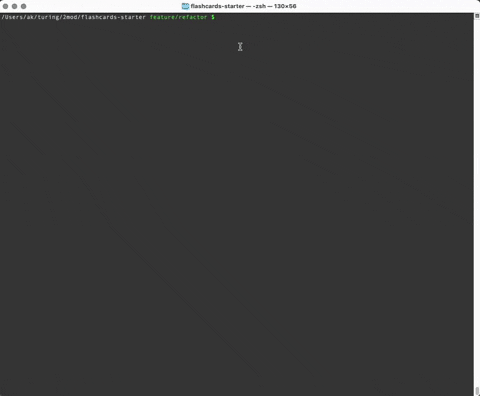

# FlashCards

This will let you play a deck of flashcards. You will be given a question, have the opportunity to select an answer, and will be told if your answer was correct or not. If you score less than 90% you will be prompted to reanswer the cards that you previously guessed incorrectly.



## Technologies Used

Javascript, Mocha, Chai, Lint

## Setup

Clone down the repo

```bash
git clone https://github.com/alexmkio/flashcards
```

Change into the root directory and install the library dependencies

```bash
cd /root_directory/

npm install
```

Start the game

```bash
node index.js
```